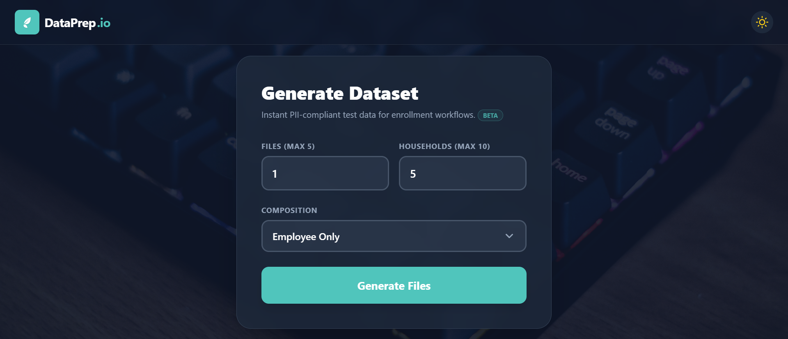

# DataPrep.io

> **Instant, PII-compliant test data generation for health insurance enrollment workflows.**


## 📸 Interface



## ⚡ Overview

**DataPrep.io** is a lightweight, client-side web application designed to eliminate the tedium of creating manual census files for QA testing. It generates perfectly formatted `.xlsx` files compatible with **AccessHealth CT** and other enrollment platforms.

Unlike other tools, DataPrep.io runs entirely in the browser—**no data is ever sent to a server**, ensuring 100% data privacy and security.

## ✨ Key Features

* **🛡️ Privacy First:** Zero backend. All PII (Personally Identifiable Information) is generated locally using `Faker.js`.
* **🚀 Blazing Fast:** Built on **Vite**, generating multiple Excel sheets in milliseconds.
* **🧠 Smart Validation:**
    * **SSN Logic:** Enforces valid prefixes and rejects invalid patterns.
    * **Business Rules:** Auto-calculates Age based on DOB.
    * **Data Integrity:** Ensures consistent `EE ID` across household members.
* **🎨 Modern UI:**
    * Fully responsive Glassmorphism design.
    * **Dark Mode** support 🌙.
    * Smooth animations and transitions.
* **📂 Bulk Export:** Generate up to 5 separate census files at once with up to 10 households per file.

## 🛠️ Tech Stack

* **Framework:** [React](https://reactjs.org/)
* **Build Tool:** [Vite](https://vitejs.dev/)
* **Styling:** [Tailwind CSS](https://tailwindcss.com/)
* **Excel Logic:** [SheetJS (xlsx)](https://sheetjs.com/)
* **Data Mocking:** [Faker.js](https://fakerjs.dev/)

## 🚀 Getting Started

1.  **Clone the repository**
    ```bash
    git clone https://github.com/mayankkalra03/dataprep.io.git
    cd dataprep.io
    ```

2.  **Install dependencies**
    ```bash
    npm install
    ```

3.  **Run the development server**
    ```bash
    npm run dev
    ```

4.  **Build for production**
    ```bash
    npm run build
    ```
